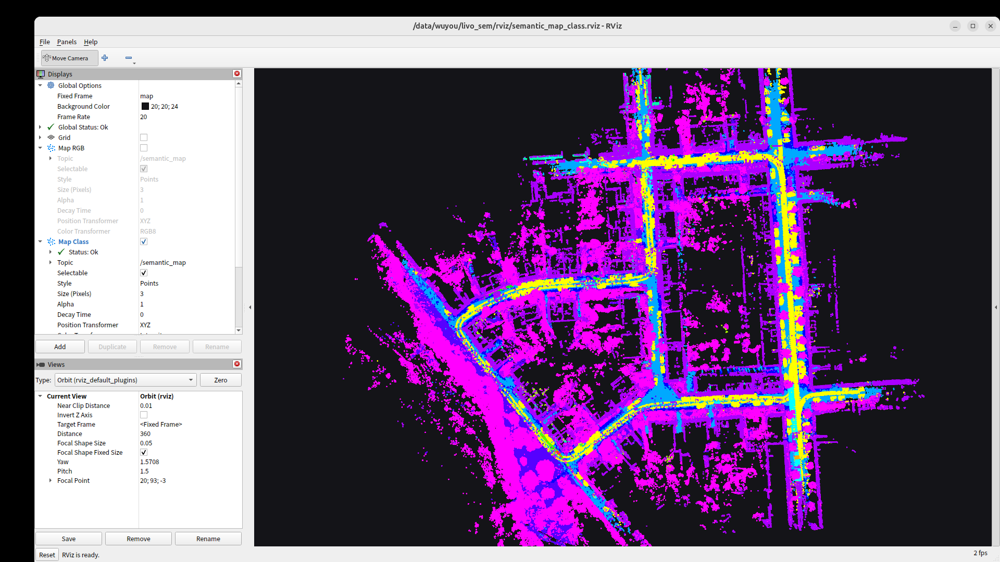
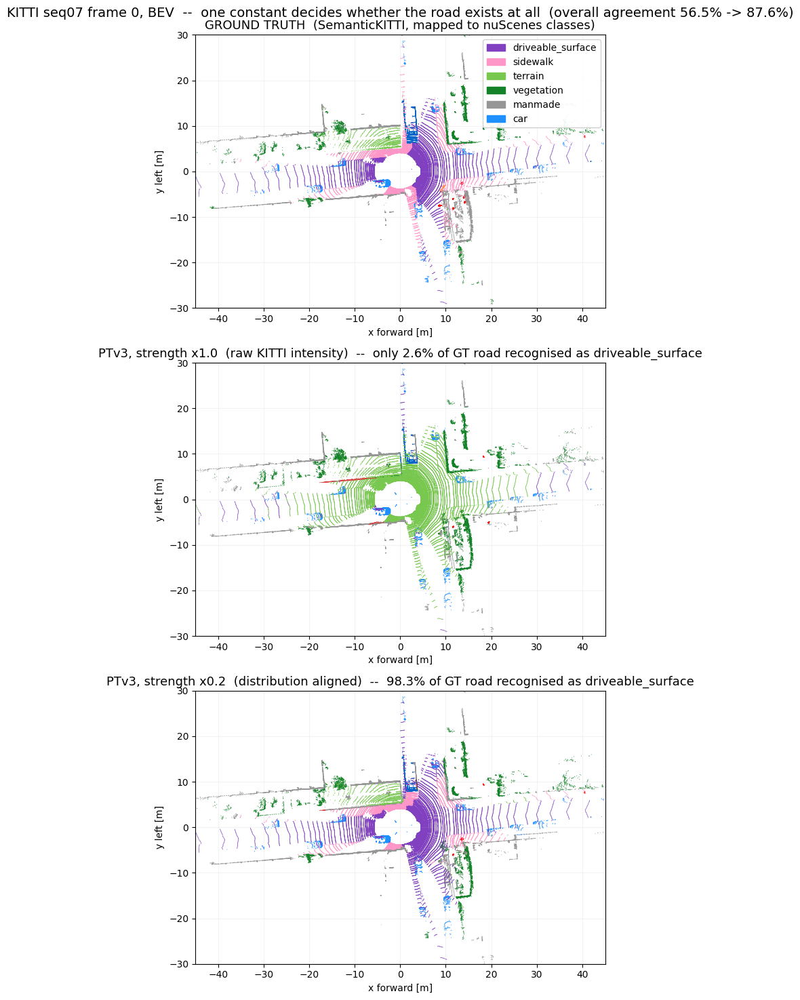

# rgb-semantic-livo-mapping

**A reproducible RGB-semantic mapper that sustains 10 Hz rosbag replay using a precomputed
FAST-LIVO2 trajectory, producing a world-frame point cloud with class, confidence and RGB coverage.**

FAST-LIVO2 supplies the pose. PTv3 supplies the semantics. The camera supplies the real colour.
ROS 2 Jazzy, KITTI + SemanticKITTI, RTX 4090.

The measured workflow has two passes: first run FAST-LIVO2 and save its TUM trajectory,
then replay the bag through the semantic/RGB mapper with that trajectory loaded at startup.
Concurrent FAST-LIVO2 + PTv3 operation with live pose arrival remains an engineering milestone.



*The full 693 m loop of KITTI seq 07, coloured by predicted class. Cyan is `driveable_surface`,
yellow is `car`, magenta is `vegetation`, purple is `manmade`. The continuous yellow ribbon down the
middle of the road is not an error — it is one moving vehicle's accumulated trail, and the repo
measures exactly that (see criterion 5).*

---

## Why this exists

Semantic mapping stacks are easy to assemble and hard to trust. Every component "runs". The map looks
plausible. Nothing throws. And yet the result can be quietly, structurally wrong.

**Six of the failures documented here produce no error message at all.** One of them — a single
constant — deletes the road from the map while the model reports 0.93 mean confidence. Another makes
`load_state_dict(..., strict=True)` report `0 missing / 0 unexpected` on a model that has been
silently replaced. A third is a source-code *comment* that was wrong, and cost 15 ms per frame for as
long as anyone had been reading it.

This repo is the opposite bet: **a baseline where every number is checked against ground truth**, so
the interesting problems can be discovered instead of assumed.

---

## What it does today

| # | Acceptance criterion | Result |
|---|---|---|
| 1 | LIVO runs stably, trajectory matches upstream | **PASS** — ATE 0.880 m, drift **0.127 %** over 693 m; estimator core differs from upstream by 3.7 %, all mechanical ROS 1→2 changes |
| 2 | Mapper throughput with precomputed poses | **PASS** — saturated frame period **60.98 ms mean / 65.99 ms p95 ⇒ 16.4 Hz ceiling** against 10 Hz replay |
| 3 | Timestamps correspond, no frame mismatch | **PASS** — 1096 trajectory/image stamp pairs, **max &#124;Δ&#124; = 477 ns** |
| 4 | RViz shows a continuously accumulating world-frame cloud | **PASS** — 2.70 M voxels @ 0.20 m, real RViz2 captures |
| 5 | Dynamic objects do not smear from sync error | **PASS** — controlled experiment, see below |
| 6 | Full mapping replay, no crash / VRAM growth / sustained drops | **PASS** — **1092 / 1092 scans, 0 dropped**, VRAM flat |

**Semantic quality**, all 1101 frames of seq 07 against SemanticKITTI ground truth, zero-shot
(nuScenes-trained weights, never fine-tuned on KITTI):

| metric | value |
|---|---|
| point accuracy | **87.3 %** |
| coarse mIoU, 11 GT-present classes | **53.2 %** |
| coarse mIoU, 9 common classes | **61.0 %** |

Per-class IoU: car 92.9 · road 83.5 · manmade 81.9 · terrain 74.6 · sidewalk 68.7 · vegetation 68.3 ·
truck 39.6 · person 38.0 · motorcycle 31.5 · bicycle 4.5 · other_vehicle 1.9

*Both mIoU columns are given on purpose. The 9-class figure is the one usually quoted for a
nuScenes→KITTI transfer; the 11-class figure is what the ground truth on these frames actually
contains. Reporting only the first is how a transfer number gets quietly inflated.*

---

## Mapper replay throughput: 152.8 ms → 61.0 ms

| stage | before | after |
|---|---|---|
| PTv3 worker (incl. its numpy prep) | 90.57 ms | **56.43** |
| IPC | 5.73 ms (1.96 MB over stdio) | 10-byte control msg (`/dev/shm` ring) |
| camera projection | 10.20 ms | **4.14** |
| voxel-hash map insert | 26.52 ms | **22.19** |
| **frame period, saturated** | **152.83 / 178.64 p95** | **60.98 / 65.99 p95** |
| scans processed @ rate 1.0 | 738 / 1096 (67.3 %) | **1092 / 1092 (0 dropped)** |

These measurements cover the mapper with recorded poses already available. The saturated
frame period measures throughput; sensor-to-output latency with online odometry, pose-wait
time and resource contention during concurrent operation still need measurement.
`/semantic_scan` publishes each processed sweep unless disabled. `/semantic_map` uses
`--map-rate 1.0` by default, with adaptive throttling for expensive snapshots; its actual
publication rate can be lower. Scan processing and full-map publication have separate rates.

Accuracy across that change: point acc 87.319 → 87.311 %, mIoU(11) 53.065 → 53.180 %.
**All three deltas are inside the arms' own repeat spread.** The speedup is free.

Where it came from — note that the two biggest wins were *not* algorithmic:

* **Two-stage pipeline** — PTv3 on the GPU for scan *k* overlapping projection + map insert for scan
  *k−1*. Turns `sum(stages)` into `max(stages)`. Zero accuracy cost by construction: pose lookup is
  keyed on each scan's own stamp, so late processing is still correct.
* **Voxel prep moved to the GPU** — −15 ms. See trap #4; this one was blocked by a wrong comment.
* **fp16 weights + fp16 feats** — −12 ms. Not `torch.autocast`, which spconv rejects. The checkpoint
  was *trained* under fp16 autocast (`enable_amp = True`), so this is in-distribution, not a gamble.
* **Hilbert serialisation rewritten** — −7 ms. v1.5.1 ships a pure-Python bit loop; replaced with
  Skilling's transform on packed int64 lanes. Bit-identical over 2.2 M codes.
* **Exact CPU rewrites** — projection −6.1 ms, map insert −4.3 ms. Bit-identical on real frames.

---

## The six silent failures this repo documents

Full detail with commands in [`CRITICAL_CONSTRAINTS.md`](CRITICAL_CONSTRAINTS.md).

### 1. A constant that deletes the road

PTv3's nuScenes weights consume `strength` (LiDAR intensity) with **no normalisation anywhere in the
test pipeline**. Pointcept's nuScenes loader does `strength = intensity / 255`; KITTI intensity is
*already* in `[0, 1]`. Both are "legal" — the distributions differ by an order of magnitude.

Feeding KITTI intensity unscaled classifies **the entire road surface as `terrain`**, with mean
confidence 0.93 and no warning.

| strength scale | point acc | road IoU | vegetation IoU |
|---|---|---|---|
| 1.0 (raw KITTI) | 57.5 % | 7.8 % | 65.9 % |
| 0.0 (zeroed) | — | 98.6 % recall | **17.1 %** |
| **0.2** | **86.3 %** | **84.1 %** | **64.7 %** |

Zeroing is *not* the fix: it rescues the road and destroys vegetation, proving the channel carries
real signal and only its scale was wrong.



### 2. "strict load succeeded" is not "the model matches"

The released PTv3 checkpoint targets **Pointcept v1.5.1**. On HEAD, `PointTransformerV3.__init__` no
longer accepts `cls_mode`. Rename the config key and `load_state_dict(..., strict=True)` reports
**0 missing / 0 unexpected** — on a broken model:

| load path | point acc | coarse mIoU | car IoU | points predicted `car` |
|---|---|---|---|---|
| HEAD + key rename | 25.7 % | 7.9 % | **0.00 %** | **5** of 2.4 M |
| **v1.5.1** | **87.3 %** | **61.0 %** | **92.9 %** | 227 920 |

A model that finds 5 car points where ground truth has 6.5 % car is not suffering a domain gap; it is
a different model wearing the same weights.

**Rule: if you had to rename, remap or drop any key to make a checkpoint load, the load is not
evidence. Verify behaviour on data with ground truth.**

### 3. A right-multiplication that only shows up in corners

FAST-LIVO2's state is the **IMU** pose, so its trajectory is `T_{W←IMU}`, not `T_{W←LiDAR}`:

```
T_W_L = T_W_I @ T_I_L
```

Omitting it is invisible in ATE — a left-multiplied global alignment absorbs a *left* constant, not a
right one. It is also invisible while driving straight, where it is a pure global translation. It
only blurs the map when `R_W_I(t)` changes. Measured over a 113.3° turn:

| metric | with `T_I_L` | without | ratio |
|---|---|---|---|
| local surface thickness, median | **0.0803 m** | 0.1080 m | 1.35× |
| ground thickness, median | **0.1056 m** | 0.1659 m | **1.57×** |
| occupied 10 cm voxels | **1.086 M** | 1.420 M | 1.31× |

### 4. A comment that was wrong, and cost 15 ms a frame

Voxel preparation stayed in single-threaded numpy because of a source comment: CUDA's float64 divide
supposedly disagrees with numpy's. Measured over 22 real scans and **8 034 645 cell indices: zero
differing entries.** The comment is true of the *float32* form — which this code never used.

Moving the whole prep to the device: **−15 ms**, bit-identical on `coord`, `strength`, `grid_coord`
and `inverse`. An unverified comment had been load-bearing.

### 5. Launch-bound, not compute-bound — which kills the obvious lever

`torch.profiler` on the forward: **40.4 ms of device time inside a 56 ms forward, 1924 kernel
launches, 13.98 ms of CPU sitting in `cudaLaunchKernel`.**

Consequence: coarsening `grid_size` — the most obvious way to make a point-cloud network faster —
**buys almost nothing here**, because voxel count is not what the clock is spent on. This was
measured as a proper sweep (`opt/sweep_grid.sh`, 200 frames, on the fixed harness) and rejected on
the numbers, after an earlier sweep run under the broken intensity scale had already been voided.

Corollary, found in the same profile: **12.44 ms of "GPU inference" was two pure-Python bit loops**
computing Hilbert codes.

### 6. The measuring instrument was measuring the wrong model

`eval_report.py` imported `PTv3Segmenter` from `ptv3_infer.py`, whose `POINTCEPT_ROOT` defaults to
Pointcept **HEAD** at intensity **1.0** — exactly the pairing trap #1 and trap #2 identify as broken.
Run as shipped, it reports ~25.7 % and car IoU 0 **regardless of what is being tested**.

Any optimisation campaign run against that instrument would have "discovered" that every change was a
regression, and reverted the good ones. The instrument is now the deployed class itself
(`ptv3_worker.Segmenter`), not a parallel implementation of it.

### Bonus: know your noise floor before you trust a delta

The model is **non-deterministic run to run**. With `shuffle_orders` pinned off, two forward passes
over the same scan in the same process still disagree on ~4–5 % of points. Bisected with forward
hooks to `SerializedPooling`'s unstable `torch.sort(cluster)`; forcing `stable=True` did not remove
it, so at least one more source remains unidentified.

**On 20 frames the instrument's own spread is ~1 point of coarse mIoU — the same size as the
acceptance gate.** Every verdict in this repo is therefore taken over all 1101 frames with repeats,
and the spread is reported next to every delta.

---

## Criterion 5, done as a controlled experiment

SemanticKITTI labels *stationary* cars `10` and *moving* cars `252`, so smear does not have to be
judged by eye. Both groups go through the identical transform chain; we measure the **world-frame
footprint length of a single sweep**:

| | clusters | footprint length median / mean / p90 |
|---|---|---|
| moving cars (252) | 51 | **3.31 / 4.24 / 9.50 m** |
| stationary cars (10) | 383 | **4.07 / 4.66 / 8.12 m** |

Moving cars are **not** longer than stationary ones. That is the right test: a stationary car keeps
its own length no matter how wrong the pose is, while a 14 m/s car placed at the wrong instant
stretches along its direction of travel. No stretching ⇒ no sync-induced smear.

Accumulation trails are a different thing and are physically inevitable without dynamic-object
removal: one tracked vehicle travels 23.0 m in 3.32 s while each sweep's footprint stays 8.39 m, so
the map keeps a ~31 m ribbon. Visible in `docs/img/rviz_dynamic_class_zoom.png`.

---

## Dynamic objects (v0.3): semantics is not a policy

A moving vehicle used to leave a ~31 m ribbon in the map. v0.3 removes it with **semantic candidate
gating + range-image free-space evidence + publish-time withholding** (no deletion, no ray casting).

The control arm is the point. "Just delete everything classified as a vehicle" is the obvious policy,
and it fails — *not* because the classifier is imperfect, but because the policy is wrong:

| arm | dynamic recall | **static false-kill** | damage ratio |
|---|---|---|---|
| no-op (v0.2) | 0 % | 0 % | — |
| naive class-delete, real PTv3 output | 97.2 % | **9.83 %** | 12.18 |
| **naive class-delete, PERFECT classifier** (analytic bound) | 100 % | **9.81 %** | 11.80 |
| **v0.3** | 60.1 % | **0.161 %** | **0.33** |

Even a zero-error classifier destroys 9.81 % of static points, because a parked car and a moving car
are the same class. seq 07 has 383 stationary car clusters against 51 moving ones. Ribbon: 2228 → 199
voxels (−91.1 %). Real-time gate met with 28 ms to spare.

**The precise negative — the false-kill floor is the trajectory, not the mechanism.** Swapping only
the pose source, identical config and frames:

| pose source | static false-kill | vehicle-parked FK | recall |
|---|---|---|---|
| FAST-LIVO2 (ATE 0.879 m) | 0.260 % | 2.454 % | 63.49 % |
| SemanticKITTI GT poses | **0.052 %** | **0.468 %** | 63.99 % |

**5.0×**, at unchanged recall. ATE 0.879 m is 4–9 voxels at 0.2 m — a map-vs-sweep visibility test
cannot beat the relative pose error between the sweep that wrote a voxel and the sweep that tests it.
That factor is bought in the pose layer, not in the carver.

Honest caveats: pooled recall is 60.1 %, not 95 % (truck 91.3 / bicyclist 67.7 / car 56.8 /
**person 17.1** — a pedestrian displaces 0.04–0.17 m per sweep, less than one 0.2 m voxel, so a
visibility test has no separation to work with). All three pre-registered gates were *just* missed
(0.161 vs ≤0.1 %, 1.504 vs ≤1 %, 91.1 vs ≥95 %) and were not relaxed afterwards.

One more instrument trap: conventional per-point mIoU **goes down** after dynamic removal
(59.42 → 58.20, 11-class), because a coarse label space scores a correctly-classified ghost as a true
positive. SemanticKITTI's moving-class ids are the only honest instrument here.

---

## "Why not project 2D segmentation onto the points?"

The obvious challenge, answered with a boundary instead of a defence.
**Full experiment, including the 14 concessions made to the 2D arm: [`docs/2d_vs_3d.md`](docs/2d_vs_3d.md).**

All 1101 frames of seq 07, common-9 label space, one mask built once and passed to both arms:

| arm | coverage | in-frustum mIoU | global mIoU (unlabelled = wrong) |
|---|---|---|---|
| **3D** — PTv3 | 100 % | 65.43 ±0.22 | **65.00 ±0.09** |
| **2D** — EoMT-L (Cityscapes 84.2) projected | **15.24 %** | **77.59** | 14.24 |
| **Hybrid** — 2D in frustum, 3D outside | 100 % | 75.89 | **66.60 ±0.04** |

**2D wins inside the frustum by 12.2 mIoU — 55× the 3D arm's own run-to-run noise.** It wins 8 of 9
classes (`person` 75.4 vs 39.8, `sidewalk` 87.9 vs 66.5). That is not a result to hide.

**3D wins the map, entirely on coverage, and the crossover is arithmetic:** at 93.74 % accuracy where
it speaks, the 2D arm would need to label 93.6 % of all points to match 3D globally. It labels 15.2 %.
The "but the camera sweeps as you drive" rebuttal gets a number too — over the whole trajectory only
**35.77 %** of occupied map voxels are *ever* seen by the camera.

**The structural weakness is geometric, and only there.** At depth discontinuities 2D drops 11.60
accuracy points against 3D's 2.73 (**4.2×**) — the only in-frustum subset 3D wins. At *semantic*
boundaries 2D still wins, so it is the projection, not the recognition.

The honest conclusion is **both**: the hybrid beats 3D alone on every global metric (66.60 vs 65.00
mIoU, 18× noise) at full coverage — for 3× the latency (335 ms serial / 253 ms parallel vs 83 ms) and
a second network. For a global map at 10 Hz, 3D is the backbone; the camera's job here is colour.

*Self-refuting bonus:* the preparation reasoned that KITTI must be upscaled 3.2× to focal-match
Cityscapes. Measured on a held-out sequence, 3.20× is **worse than native**; the optimum is 1.30×.
Following the reasoned default would have handicapped the 2D arm by ~2.3 mIoU.


## Architecture

```
Pass 1: rosbag -> FAST-LIVO2 (ROS 2 port) -> saved TUM trajectory T_{W<-IMU}
                                          keyed on true sensor time

Pass 2: rosbag replay                     saved TUM loaded at node startup
  /velodyne_points  10 Hz                      │
  /camera/image_raw 10 Hz                      │
  /camera/camera_info                          │
        │                                     │
   ┌────┴─────────────── stage A (executor thread) ──────────────┐
   │  parse, per-point time, pose gate, write /dev/shm slot      │
   │  submit to PTv3 coprocess (non-blocking)                    │
   └────┬────────────────────────────────────────────────────────┘
        │                          ▼  GPU, scan k
        │              PTv3 (nuScenes, Pointcept v1.5.1, fp16)
        │              intensity x 0.2, GPU voxel prep
        │              per-point class + confidence
        │                          │
   ┌────┴─────────── stage B (worker thread, scan k-1) ──────────┐
   │  confidence gate -> de-skew (128 bins) -> project to cam2   │
   │  -> T_W_L = T_W_I @ T_I_L -> voxel hash insert -> publish   │
   └─────────────────────────────────────────────────────────────┘
                       ▼
        /semantic_scan  every processed sweep
        /semantic_map   default 1 Hz setting, adaptively throttled
        PointCloud2, point_step 28
        x f4 | y f4 | z f4 | rgb f4 | class u16 | confidence f4 | has_rgb u8
```

FAST-LIVO2 is a **pose source only**, via the saved TUM file in this implementation.
`SemanticMapNode` constructs `TrajInterp(args.traj)` at startup; the pose lookup interpolates
that complete file. Its `/cloud_registered` is deliberately not consumed: in LIVO mode ~52 %
of those messages are empty and the rest carry only the camera-frustum subset of the scan.

**Fusion rule.** Class: confidence-weighted vote, `score[voxel][c] += softmax_max_prob`, argmax wins.
Confidence: winner's share of total vote weight. RGB: mean over observations that actually had camera
coverage; voxels with none get `has_rgb = 0` and a sentinel grey rather than a misleading black.
37.7 % of map voxels end up with RGB (a single sweep only sees 16.2 %).

---

## Reproduce

Requires ROS 2 Jazzy, an NVIDIA GPU, and ~50 GB for KITTI + bags.
The commands below run trajectory generation and semantic mapping in separate passes.

```bash
./setup_ros2.sh          # ROS 2 Jazzy desktop
./mkenv.sh               # conda env: torch + spconv + torch_scatter + flash-attn
./fetch_kitti.sh         # KITTI raw drives 0027 / 0016 + SemanticKITTI labels
./fetch_ptv3.sh          # Pointcept v1.5.1 + nuScenes PTv3 checkpoint
./build_bags.sh          # KITTI -> ROS 2 mcap   (use the _us bags, see below)

# Pass 1: generate and save the trajectory.
./run_fastlivo2_kitti.sh seq07 bags/kitti_seq07_us 0.5
# Pass 2: replay at sensor rate using the saved trajectory.
./opt/run.sh after3 src bags/kitti_seq07_us \
    out/kitti_seq07_fastlivo2_tum.txt 1.0 \
    --reliable --conf-gate 0.5 --expect-voxels 4000000
python3 opt/summ.py opt/out/stats_after3.json

rviz2 -d rviz/semantic_map.rviz      # toggle "Map Class" to switch views
```

Accuracy, on the shipped path, all 1101 frames:

```bash
python src/eval_report.py --nframes 1101 --stride 1 --tag AFTER \
    --shuffle 0 --half 1 --fast-voxel 1 --gpu-voxel 1 --fast-hilbert 1
```

Every numeric optimisation ships with a verifier rather than an argument — `opt/verify_fast.py`,
`opt/verify_voxel_fast.py`, `opt/verify_cpu_exact.py`, `opt/bisect_nondet.py`.

Two things that will bite you if skipped:

* **Use the `_us` bags.** FAST-LIVO2's `preprocess.cpp` reads `curvature = time / 1000 // ms`, i.e. it
  wants **microseconds**. A control run with seconds gives ATE **50.6 m** and a 25 %-short trajectory.
* **Export `FASTDDS_BUILTIN_TRANSPORTS=LARGE_DATA`.** With default transports a 2.7 MB `BEST_EFFORT`
  sample loses 63 % of scans even when the consumer is completely idle and the CPU is 99 % free.
  "Frames not received" is not the same as "the node cannot keep up".

---

## Known limits, stated plainly

* **Dynamic removal recalls 60.1 % of moving points**, and only 17.1 % for pedestrians — they move
  less than one voxel per sweep. Its false-kill floor is set by trajectory error, not by the mechanism.
* **RGB covers 37.7 % of map voxels.** The camera is a narrow forward frustum; the LiDAR is 360°.
* **The model is not bit-deterministic** and one source of it remains unidentified (see above).
  Confidence is meaningful, so the map is gated at `conf ≥ 0.5`.
* **The 10 Hz acceptance uses a precomputed trajectory.** Live pose buffering, concurrent
  odometry/semantic processing and end-to-end online latency remain unvalidated.
* **Per-point deskew is currently accuracy-neutral** on this data (within ±5 % on every sharpness
  metric). It is kept because camera projection needs per-point world coordinates.
* **Live `/semantic_map` is capped at 1 M published points** for the visualiser; the saved `.npz`
  keeps full resolution.

---

## v0.4 — camera-supervised adaptation, first results

**Camera pseudo-label fine-tuning improves outside-frustum mIoU-9 from 65.01 to
72.98 (+7.96 points)** on all 1,101 frames of SemanticKITTI seq 07. The adapted
student uses point clouds alone for semantic inference.

| Arm | Training supervision | Outside mIoU-9 ± SD | Δ vs zero-shot |
|---|---|---:|---:|
| A | Frozen nuScenes model | 65.01 ± 0.25 | — |
| B1 | Camera pseudo-labels, head only | 65.90 ± 0.22 | +0.88 |
| **B0** | **Camera pseudo-labels, full fine-tuning** | **72.98 ± 0.17** | **+7.96** |
| D | GT inside the camera frustum | 74.68 ± 0.15 | +9.67 |
| R | GT on random raw points | 82.75 ± 0.14 | +17.74 |
| R′ | GT on random surviving voxels | 83.36 ± 0.11 | +18.34 |
| C | GT everywhere, with KL | 85.94 ± 0.06 | +20.93 |

Each adapted arm is **one training run with three inference draws**; A has six
inference draws. ± is inference SD, not variation across training seeds. D/R/R′/C
are target-3D-GT diagnostic references. B0 is the camera-supervised method; its
outside-frustum mIoU-8 delta is +8.11 when `two_wheeler` is removed for decomposition.

The [original preregistration](docs/v04_preregistration.md) remains unchanged.
B0 exceeds the aggregate score threshold, but its predicted class-sign pattern
matches only **5/8** cells, so that mechanism explanation did not pass. R′ matches
D's total supervision after voxelisation (ratio **0.999920**) and scores 8.68 points
higher, with class composition and KL-region geometry still differing.

**Status, 2026-09-24:** D_noKL and Rprime_noKL are running under a new paired
protocol. Their final scores are pending. The existing 10 Hz mapping result is
from v0.2/v0.3; deployment of the fine-tuned student is a later validation gate.

See [full results, evaluation conditions and next steps](docs/v04_results.md),
[all metrics and per-class results](results/v04/completed_summary.md), and the
[experiment source snapshot](experiments/v04/README.md). Checkpoint selection uses
seq 08 GT; independent training repeats and evaluation on data unseen during
method development remain outstanding.

Verify the archived numbers without a GPU or dataset:

```bash
python3 tools/summarize_v04.py --check
```


## Roadmap

**v0.1 — the honest baseline.** Four components, six criteria, every number against ground truth.

**v0.2 — mapper replay throughput. ✅ done.** 152.8 → 61.0 ms, a 16.4 Hz ceiling against 10 Hz replay, accuracy
unchanged. Along the way: the obvious lever (`grid_size`) was measured and rejected, and two of the
three biggest wins turned out to be a wrong comment and a pure-Python loop.

**v0.3 — make the map honest about time. ✅ done.** Dynamic-object handling scored against
SemanticKITTI's moving-class ids. Ribbon −91.1 %, static false-kill 0.161 % against the naive
control arm's 9.83 % — 61× — and 62× against that arm's *perfect-classifier* bound. The finding that
matters is the precise negative: the false-kill floor is the trajectory (5.0× better on GT poses),
not the removal mechanism.

**v0.4 — camera-supervised transfer. In progress.** First adaptation results and GT diagnostics
are complete. Next: finish the no-KL pair, validate B0 in fixed-trajectory mapping replay,
improve and independently repeat the method, and evaluate on unseen data. Live-pose integration
and concurrent FAST-LIVO2/PTv3 acceptance are a separate engineering gate.
The [detailed milestones](docs/v04_results.md#next-milestones) define those checks.

**v0.5 — beyond the rotating scanner.** Non-repetitive solid-state patterns (Livox) break the
implicit assumptions of every model trained on spinning LiDAR. The measurement harness here is the
prerequisite for saying anything defensible about it.

---

## Credits

Built on work by others, none of it claimed here:

* [FAST-LIVO2](https://github.com/hku-mars/FAST-LIVO2) — Chunran Zheng et al., HKU MARS Lab (GPLv2)
* ROS 2 port: [Robotic-Developer-Road/FAST-LIVO2](https://github.com/Robotic-Developer-Road/FAST-LIVO2), branch `humble`
* [Point Transformer V3](https://github.com/Pointcept/PointTransformerV3) / [Pointcept](https://github.com/Pointcept/Pointcept) — Xiaoyang Wu et al. (**pin v1.5.1**)
* [KITTI](https://www.cvlibs.net/datasets/kitti/) and [SemanticKITTI](http://www.semantic-kitti.org/)

This repository contains the integration, the measurement harness, and the failure analysis.
