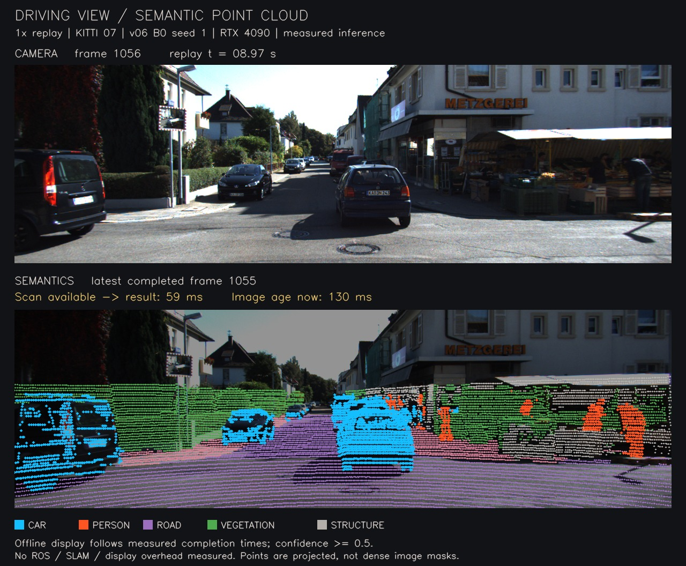

# 驾驶视角语义回放

[下载 14 秒视频（MP4，约 12 MB）](https://github.com/KaiFeng-Frank/rgb-semantic-livo-mapping/releases/download/driving-demo-20260928/driving_semantics_seq07_measured.mp4)
· [视频与测量附件](https://github.com/KaiFeng-Frank/rgb-semantic-livo-mapping/releases/tag/driving-demo-20260928)



KITTI 序列 07 的连续帧 970–1100，按原始传感器时间以 1 倍速回放。
上方是当时的相机画面，下方是最近一帧已经算完的语义点云，投影在其对应的相机画面上。
蓝色表示汽车，橙色表示行人；画面中的标签均为模型预测，置信度阈值为 0.5。
下方会落后于上方，只有到达本次实测的推理完成时刻才更新。

模型使用 v0.6 `armB0_s1_student.pth`，SHA-256 为
`35f5d3aec63ae1c383f4a4146e157aa054860cb12b178d899571287e6f97e5f1`。
加载冻结的 Pointcept v1.5.1，严格匹配 488 个张量；强度乘 0.2，体素 0.05 m，
FP16，关闭 shuffle 和 TTA。片段依据场景里的人车选择，没有依据模型效果筛帧。

## 本次测量

RTX 4090，131 帧，先暖机，输入预加载到内存，按扫描结束时间逐帧送入单个推理实例。
推理包含 GPU 体素化和预测结果回到 CPU。131 帧全部处理，排队时间最高约 0.60 ms。

| 时间范围 | 中位数 | P95 | 最大值 |
|---|---:|---:|---:|
| 完整激光扫描可用 → 语义结果就绪 | 59.24 ms | 60.62 ms | 61.36 ms |
| 相机时间戳 → 该帧语义结果就绪 | 112.66 ms | 114.03 ms | 114.86 ms |

视频离线绘制，但逐帧遵守本次实际记录的完成时间，不提前显示预测。屏幕上的
`Image age now` 还会计入视频下一次刷新之前的等待，所以会高于表中的结果就绪时间。
视频为 30 fps，总共 421 帧；相机本身约 9.6 Hz。

这里没有测量磁盘读取、冷启动、ROS 通信、FAST-LIVO2 并行运行、地图融合或实际屏幕显示。
完整在线系统的原始测量见 [v0.6 在线集成](v06_online_integration.md)；它使用 v0.5 B0 权重，
不能用这里的单独推理耗时替代。

## 记录与复现

- [逐帧时间与输入、输出校验值](../results/v06/driving_demo_20260928/measurement.json)
- [编码、完整解码和时序检查](../results/v06/driving_demo_20260928/video-check.json)
- [测量与渲染脚本](../tools/record_driving_semantics.py)
- [权重与原实验的恢复说明](artifact_recovery.md)

视频 Release 还包含 `driving-demo-predictions.tar`，保存这次测量产生的 131 帧预测，
以及 `demo-manifest.json` 和 `SHA256SUMS`。恢复这些预测后，可仅运行渲染命令重建相同视频；
压缩包中的 133 个文件均已逐一校验。

在具备原始 KITTI 数据和已验证 PTv3 环境的实验服务器上执行。
先将模型 Release 的 `semantic-runtime-and-metadata.tar` 恢复到实验目录；
下例保留归档运行时使用的原路径 `/data/wuyou/livo_sem`。换目录时还需同步修改
已验证加载器里的路径常量，保持 Pointcept 版本和模型结构不变。

```bash
TASK_ROOT=/data/wuyou/livo_sem
TASK_OUT="$TASK_ROOT/out/driving_demo"
python tools/record_driving_semantics.py measure --root "$TASK_ROOT" --out "$TASK_OUT"
/usr/bin/python3 tools/record_driving_semantics.py render --root "$TASK_ROOT" --out "$TASK_OUT"
```

第一条 Python 命令应在 PTv3 环境运行；渲染环境需要 NumPy 和 OpenCV。
重新测量会产生新时间和预测，不能覆盖这里的历史记录。
原始图像和点云仍从数据集原始来源获取，不随本视频附件分发。
