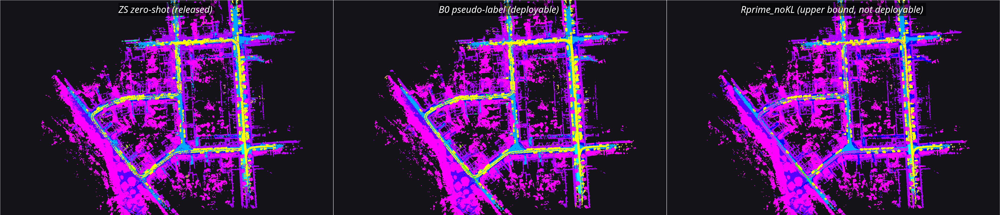
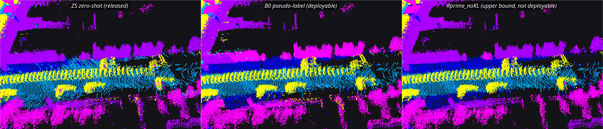
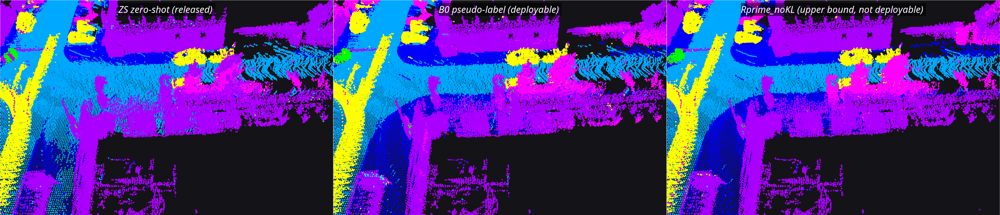

# v0.5 results: trained checkpoints in the mapper, first map-level measurement

Updated 2026-09-26. v0.5 loads three PTv3 checkpoints into the mapping pipeline and
measures, for the first time, the semantic quality of the fused map instead of the
per-scan predictions it is built from.

| tag | checkpoint | supervision on KITTI |
|---|---|---|
| ZS | released nuScenes PTv3-m1 | none (zero-shot) |
| B0 | v0.4 arm B0 | camera pseudo-labels from the 2D teacher, zero human 3D labels (deployable) |
| RP | v0.4 arm R′ without KL (`Rprime_noKL`) | randomly scattered target GT (reference, not deployable) |

RTX 4090, Ubuntu 24.04, ROS 2 Jazzy; Pointcept v1.5.1, fp16, `shuffle_orders=False`,
intensity ×0.2, grid 0.05; SemanticKITTI seq 07, read at scoring time only. The complete
tables are in [`results/v05/REPORT.md`](../results/v05/REPORT.md); every inference draw and
run is in [`results/v05/summary.json`](../results/v05/summary.json).

## One source change: a checkpoint selector

`--ptv3-ckpt` on the node → `PTV3_CKPT` in the worker's environment → `build_ptv3(ckpt_path=)`
in the loader. Without the flag every path is the v0.2/v0.3 behaviour: the released
checkpoint is loaded from the same constant, `strict=True` either way. `tools/v05_patch.py`
applied the edit as exact-string substitutions that each had to match once;
[`experiments/v05/checkpoint_selector.diff`](../experiments/v05/checkpoint_selector.diff)
shows it against the pre-v0.5 modules.

## Extraction: prove it is the same model before it goes near the pipeline

A trained checkpoint holds 976 tensors: the 488-tensor student (`backbone.*` 486 +
`seg_head.*` 2), with the released checkpoint's exact key set, shapes and dtypes, plus the
fp16 anti-forgetting anchor (`frozen_backbone.*`, `frozen_head.*`), which is never deployed.
`tools/extract_student.py` keeps the student and must pass four checks:

- **S1 structure** — strict load 488/488, 0 missing, 0 unexpected.
- **S2 weights** — every tensor `torch.equal` to the training-time student, in fp32 and fp16.
- **S3 code path** — identical module tree, parameters and buffers.
- **S4 behaviour** — on 101 seq-07 frames, argmax agreement extracted-vs-original must sit
  inside the same-model repeat agreement at every logit-margin stratum. The forward is
  non-deterministic, so bitwise equality is never demanded; a different student is the
  negative control.

S1–S3 pass for all three: 0 missing / 0 unexpected, 488/488 tensors equal in fp32 and fp16,
equal trees.

| tag | source epoch / seq08 val | S4 cross vs within agreement (all; margin>2) | negative control (all) | GT acc distil / plain / worker | verdict |
|---|---|---|---|---|---|
| ZS | 48 / 0.7831 | 0.95847 vs 0.95963; 0.99411 vs 0.99610 | - | 87.99 / 87.82 / 87.76 | PASS |
| B0 | 1 / 0.6831 | 0.97575 vs 0.97665; 0.99967 vs 0.99970 | 0.89770 | 90.07 / 90.12 / 90.18 | PASS |
| Rprime_noKL | 2 / 0.8678 | 0.99089 vs 0.99086; 0.99890 vs 0.99913 | 0.89665 | 95.81 / 95.78 / 95.75 | PASS |

## M1 — latency follows the architecture, not the weights

Saturated runs: bag rate 2.0, node-intrinsic period between consecutive stage-B
completions, three interleaved repetitions per model, identical node arguments except
`--ptv3-ckpt`.

| model | frame period mean / p95 (mean of 3) | median of 3 | ceiling | PTv3 worker mean |
|---|---|---|---:|---:|
| ZS | 57.46 / 63.54 ms | 57.83 / 62.52 ms | 17.3 Hz | 57.13 ms |
| B0 | 57.95 / 63.63 ms | 57.68 / 62.99 ms | 17.3 Hz | 57.65 ms |
| RP | 61.34 / 67.74 ms | 60.39 / 66.13 ms | 16.6 Hz | 60.75 ms |

v0.2 reference (zero-shot): 60.98 / 65.99 ms. RP's first repetition stepped mid-run in the
worker stage (58.3 ms for the first 15 s, 68.2 ms after) and the same checkpoint did not
reproduce it (58.10 and 60.39 ms in the other two). RP also ran third in every interleaved
triplet, on the warmest GPU; the order is to be rotated in the next timing round.

Full bag at rate 1.0, the qualification run whose map is scored below:

| model | received / processed / back-pressure drops | map voxels | peak VRAM | node / worker peak RSS | frame period mean |
|---|---|---:|---:|---|---:|
| ZS | 1081 / 1075 / 6 | 2667737 | 1459 MiB | 1.232 / 1.631 GB | 103.79 ms |
| B0 | 1091 / 1084 / 7 | 2677268 | 1459 MiB | 1.091 / 1.611 GB | 104.03 ms |
| RP | 1092 / 1086 / 6 | 2708416 | 1459 MiB | 1.173 / 1.621 GB | 103.79 ms |

Every back-pressure drop falls inside the first ~1.5 s of a run (the RELIABLE start-up
burst), none afterwards. v0.2 reference: 1092/1092 processed, peak VRAM 1459 MiB,
2700844 voxels. The sweeps missing from "received" were later traced to `ros2 bag play`
publishing before discovery completes ([v0.6](v06_online_integration.md), `-d 3`).

## M2 — map-level semantic quality

`opt/replay_v05.py` replays stage B on the CPU from the same cached per-point predictions
the offline numbers were scored from; its `offline_all` reading reproduces the frozen v0.4
harness. Common-9 label space, SemanticKITTI seq 07 GT. Readings:

- **offline_all** — per-scan prediction against GT, every evaluated point (the v0.4 number).
- **offline_inserted** — the same, only the points the pipeline inserted (pose ok, conf ≥ 0.5).
- **map, per-point GT** — the fused voxel class against each inserted point's own GT.
- **map, voxel-majority GT** — the v0.3 definition.
- **map, all evaluated points** — every evaluated point looks up the voxel it would have
  landed in; a point with no voxel counts as wrong.
- **live map** — the node-written map of the rate-1.0 ROS run, same lookup, one draw.

Out-of-frustum mIoU-9:

| reading | ZS (6 draws) | B0 (3 draws) | RP (3 draws) |
|---|---:|---:|---:|
| offline_all | 65.01 ± 0.25 | 72.98 ± 0.17 | 84.89 ± 0.24 |
| offline_inserted | 67.27 ± 0.27 | 75.60 ± 0.14 | 85.25 ± 0.24 |
| map, per-point GT, inserted points | 71.63 ± 0.36 | 79.06 ± 0.22 | 85.99 ± 0.15 |
| map, voxel-majority GT | 73.05 ± 0.36 | 80.83 ± 0.26 | 88.22 ± 0.16 |
| **map, all evaluated points** | **70.37 ± 0.37** | **77.49 ± 0.19** | **85.25 ± 0.14** |
| live map (one draw) | 72.00 | 77.82 | 85.54 |

In-frustum and global, the same readings side by side:

| reading | ZS in / global | B0 in / global | RP in / global |
|---|---|---|---|
| offline_all | 65.35 ± 0.19 / 65.06 ± 0.21 | 70.61 ± 0.34 / 72.61 ± 0.19 | 86.99 ± 0.07 / 85.37 ± 0.20 |
| map, all evaluated points | 69.72 ± 0.50 / 70.28 ± 0.33 | 77.28 ± 0.41 / 77.49 ± 0.23 | 86.49 ± 0.03 / 85.55 ± 0.11 |
| live map (one draw) | 70.58 / 71.75 | 77.69 / 77.85 | 87.39 / 85.98 |

Where the out-of-frustum map/per-scan difference comes from:

| term | ZS | B0 | RP |
|---|---:|---:|---:|
| confidence-gate selection (offline_all → offline_inserted) | +2.26 | +2.62 | +0.35 |
| fusion on the inserted points (→ map, per-point GT) | +4.36 | +3.46 | +0.74 |
| coverage of gated-out and no-pose points (→ map, all points) | −1.26 | −1.57 | −0.74 |
| **end to end** | **+5.36** | **+4.51** | **+0.35** |

Per class, out-of-frustum IoU, offline → map (all points):

| class | ZS | B0 | RP |
|---|---|---|---|
| car | 94.4 → 95.7 | 95.6 → 96.6 | 98.2 → **97.3** |
| large_vehicle | 38.1 → 61.1 | 55.5 → 68.8 | 61.8 → 64.4 |
| two_wheeler | 38.6 → 42.0 | 45.4 → 53.0 | 83.0 → 84.9 |
| person | 38.2 → 39.8 | 60.6 → 67.7 | 67.7 → 72.7 |
| road | 81.3 → 83.3 | 85.0 → 86.7 | 96.9 → **95.3** |
| sidewalk | 69.4 → 73.7 | 76.3 → 78.8 | 93.5 → **90.5** |
| terrain | 74.3 → 79.6 | 79.9 → 83.2 | 83.9 → **83.4** |
| vegetation | 68.0 → 72.5 | 72.7 → 75.7 | 85.7 → 86.3 |
| manmade | 82.9 → 85.6 | 85.7 → 86.8 | 93.2 → **92.4** |

In-frustum minus out-of-frustum point accuracy, offline → map: ZS +1.93 → +1.23,
B0 −2.65 → +0.44, RP −0.22 → −0.19.

## What the map measurement says

1. **The map beats the scan.** For all three checkpoints the fused map scores higher than
   the per-scan predictions it is built from. The work is done by confidence-weighted
   voting over many views of each voxel; the confidence gate's selection adds to it and the
   gated-out and no-pose points subtract.
2. **The margin collapses as the classifier strengthens.** Voting averages away per-scan
   noise, so the less noise there is, the less it buys: ZS and B0 gain several points, RP
   almost nothing.
3. **The strongest checkpoint loses the flat and boundary classes at map level.** RP's map
   scores below its own per-scan predictions on road, sidewalk, car, terrain and manmade.
   That is the pipeline's geometric cost (0.20 m voxels, a 0.88 m ATE trajectory); it is
   visible only once per-scan noise is gone. The v0.6 residual anatomy finds RP's road and
   sidewalk map errors majority voxel mixing ([evaluation unit](v06_evaluation_unit.md)).
4. **The camera-frustum split dissolves at map level.** Every voxel is voted on from many
   viewpoints; B0's in-minus-out accuracy gap moves from −2.65 per scan to +0.44 in the map.

All of these readings weight every scored point equally. The
[evaluation-unit analysis](v06_evaluation_unit.md) shows that 90.7 % of B0's scored points
sit in voxels within 10 m of the trajectory and that the same maps read 6–8 points lower when each
map cell counts once. Per cell, the one draw measured so far keeps the order of finding 1:
B0's map 70.97 against 68.74 per scan, out-of-frustum.

## M3 — RViz2 captures

Class view: RViz Intensity transformer on the `class` channel, bounds 0..15, rainbow. Car
yellow, driveable_surface cyan-blue, sidewalk blue, terrain violet, manmade purple,
vegetation magenta, truck cyan. Captured from the latched map after each run; left to
right ZS | B0 | RP.

*The whole seq-07 map. Live-map disagreement ZS vs B0: 247948 of 2636599 key-matched voxels
differ (9.40 %); B0 vs RP: 288122 of 2667129 (10.80 %).*

*Tile zA (−115.1, 143.8, −1.1), the 10 m tile where ZS and B0 disagree most (48.3 % of its
voxels). B0 relabels building facade manmade → vegetation and is wrong there: accuracy on
GT-labelled voxels ZS 87.8, B0 43.5.*

*Tile zB (−95.9, 4.4, 4.0). B0 relabels the zero-shot road → sidewalk and is right: ZS
42.6, B0 84.9.*

The tiles are chosen by `tools/v05_zoom_region.py` from the live maps, by measurement.

## Files and reproduction

| path | content |
|---|---|
| [`results/v05/REPORT.md`](../results/v05/REPORT.md) | complete M1/M2/M3 tables, per repetition |
| [`results/v05/summary.json`](../results/v05/summary.json) | every run and draw behind the report |
| `results/v05/extract_{ZS,B0,Rprime_noKL}.json` | the four extraction checks per checkpoint |
| [`results/v05/snapshot_manifest.json`](../results/v05/snapshot_manifest.json) | original path, published path and SHA-256 of every file |
| [`experiments/v05/`](../experiments/v05/README.md) | source snapshot: selector, extraction, replay scorer, drivers |

Checkpoints, prediction caches, bags and map `.npz` files stay outside the repository.
`tools/v05_report.py` writes `REPORT.md` and `summary.json` from the measured files; no
number in them is typed in by hand.
