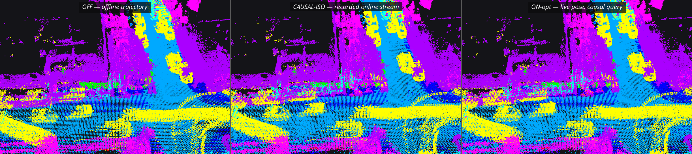
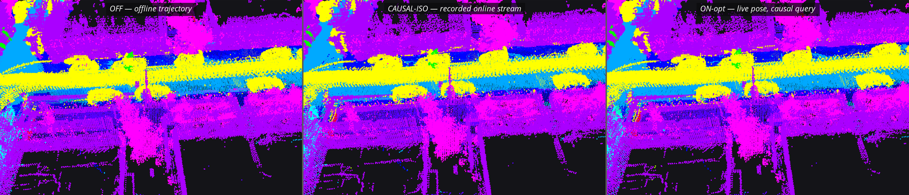

# v0.6 online integration: live FAST-LIVO2 poses into the mapper

Updated 2026-09-26. v0.6 runs FAST-LIVO2 and the semantic mapper concurrently on the
seq-07 bag at sensor rate and feeds the mapper live poses through a causal query. The
question is what the online path costs, and where.

RTX 4090, 12-core Xeon Gold 6248R (no SMT), Ubuntu 24.04, ROS 2 Jazzy (Fast DDS 2.14),
Pointcept v1.5.1, fp16, `shuffle_orders=False`, intensity ×0.2, grid 0.05; the v0.5 B0
checkpoint everywhere; seq 07 read at scoring time only. The complete measurement tables
are in [`results/v06/online/REPORT.md`](../results/v06/online/REPORT.md) and
[`summary.json`](../results/v06/online/summary.json).

## Protocol

`bags/kitti_seq07_us` at rate 1.0 with `--clock -d 3`; node arguments
`--reliable --conf-gate 0.5 --expect-voxels 4000000` (the v0.5 qualification line);
`FASTDDS_BUILTIN_TRANSPORTS=LARGE_DATA` unless stated; a subscriber-side probe on
`/semantic_scan` and `/semantic_map` in every node run. Three repetitions per arm,
interleaved, one run at a time, an `nvidia-smi` compute-process gate before each run;
foreign CPU load re-derived afterwards stayed below 13 % of one core in every run.

| arm | processes | pose source | query |
|---|---|---|---|
| fl | FAST-LIVO2 alone | — | — (contention baseline; its evo file is the online-alone trajectory) |
| **off** | node + PTv3 worker + probe | offline TUM (rate 0.5), the v0.5 input | non-causal interpolation |
| **onopt** | FAST-LIVO2 + node + worker + probe | live `/aft_mapped_to_init` | causal; tail beyond the newest sample extrapolated with constant twist (`cv`) |
| **iso** (CAUSAL-ISO) | node + worker + probe | every sample the ON-opt run *i* received, saved as TUM | non-causal interpolation |
| onimu | FAST-LIVO2 (`uav.imu_rate_odom:=true`) + node + worker + probe | live `/LIVO2/imu_propagate` | causal |
| onopthold | as onopt | `/aft_mapped_to_init` | causal; tail held at the newest pose |
| onopttx | as onopt | `/aft_mapped_to_init` | causal, `cv`; tuned transport for every process |

CAUSAL-ISO is what separates the two costs. It replays the exact pose stream an online run
received, but lets every sweep see its future samples. ON-opt − CAUSAL-ISO is the price of
causality alone, on the same trajectory; CAUSAL-ISO − OFF is the price of the online
trajectory itself.

## Code changes

| file | change |
|---|---|
| `src/semantic_map_node.py` | `--pose-topic` online mode: a live pose buffer fed by a `nav_msgs/Odometry` subscription; causal query (interpolation over the samples that have arrived, `cv`/`hold` extrapolation beyond the newest, `--pose-max-extrap` staleness gate, optional `--pose-wait-ms`); frame, pose-stream and used-pose records for measurement |
| FAST-LIVO2 `src/LIVMapper.cpp:1417` | `/aft_mapped_to_init` stamped with `last_lio_update_time` instead of `now()` — ROS glue only, estimator untouched ([patch](../experiments/v06/patches/fast_livo2_lio_sensor_stamp.patch)) |
| rpg_vikit `params_helper.h:117` | remote-parameter wait 100 ms → 10 s ([patch](../experiments/v06/patches/vikit_remote_param_wait.patch)) |
| `opt/run_v06.sh`, `opt/v06_all.sh`, `opt/v06_post.sh` | one run / the matrix / post-processing; `ros2 bag play --clock -d 3` |
| `opt/res_sampler_v06.py`, `opt/topic_probe_v06.py` | 1 Hz per-process CPU/RSS and GPU sampler; subscriber-side delivery counter |
| `opt/replay_v06.py` | the v0.5 scorer plus `--pose-used`: score a live map at the causal placement the node actually applied, and the geometric footprint |
| `opt/verify_v06.py` | old and new node in one process on identical cached predictions |

**The default path is unchanged, bit for bit.** `opt/verify_v06.py` pushes 40 real sweeps
and images through the v0.6 node without `--pose-topic` and through the v0.5 node, with a
stub that hands both the same cached predictions: every map array, the hash table, the
written `.npz` and the non-timing stats fields are identical — 19 checks PASS, 0 FAIL.

## What the integration exposed

1. **FAST-LIVO2 is not reproducible at real-time rate.** 15 rate-1.0 runs of the same bag,
   alone and beside the node: ATE RMSE **0.888 ± 0.115 m** (min 0.660, max 1.115). The
   offline 0.880 m at rate 0.5, the trajectory of v0.1–v0.5, is one draw from this spread.
   Pairs of runs diverge by up to 1.9 m in the shared world frame; running beside the node
   does not shift the distribution.
2. **The map metric does not see it.** Across all 18 maps, each scored on the trajectory it
   was built with, a map's own-trajectory ATE and its mIoU-9 correlate at r = 0.29 (fitted
   slope +0.6 mIoU-9 per metre over 0.652–1.115 m). The label-consistency reading is blind
   to global trajectory error in this range; a single online-versus-offline comparison is
   a lottery ticket, and three paired repetitions are the minimum.
3. **The causal query costs nothing measurable.** ON-opt − CAUSAL-ISO, same trajectory:
   +0.07 ± 0.18 out-of-frustum mIoU-9. Its geometric footprint: |dp| p50 0.4 mm, p95 2.6 cm;
   4 % of points change voxel; the map grows 3 %.
4. **The online cost is a trajectory draw.** CAUSAL-ISO − OFF: −0.22 ± 0.16 (live maps),
   −0.16 ± 0.04 (replay, identical cached predictions). Everything together, ON-opt − OFF:
   −0.15 ± 0.27, inside the spread of a single arm.
5. **FAST-LIVO2's ROS 2 topics carry no sensor time.** `/aft_mapped_to_init`,
   `/cloud_registered`, `/path`, `/mavros/vision_pose/pose` and `/rgb_img` are all stamped
   `now()`; only the evo file uses `last_lio_update_time`. A consumer that de-skews cannot
   associate such a pose with a sweep. One line of ROS glue fixes it; the streamed pose then
   equals the evo file's.
6. **A sweep's pose exists only after the whole sweep plus ~30 ms of LIO, stamped
   mid-sweep.** The in-sweep pose arrives 44 ms (p50) / 63 ms (p95) after the sweep; the
   newest usable sample sits about half-way through it, so every sweep extrapolates ~53 ms
   (~158 ms when stage B beats the pose). The sample that covers the sweep end is the next
   sweep's update, 148 ms (p50) after arrival — longer than the 104 ms period, so a
   wait-for-coverage policy is not affordable.
7. **Holding the newest pose instead of extrapolating is invisible at the node's own
   placement.** `hold` scores 77.87 ± 0.37 where the node put the points and 76.18 ± 0.38
   where the points should have been; 35 % of points change voxel. `cv` reads 77.96 ± 0.19
   and 77.94 ± 0.18. A causal-pose change has to be read at both placements and with its
   geometric footprint, or the metric lies.
8. **The IMU-propagated pose is worse.** `/LIVO2/imu_propagate` is off by default
   (`uav.imu_rate_odom: false`); enabled, it publishes from a 4 ms wall timer at ~71 Hz, not
   100 Hz (~29 % of IMU samples coalesced), and re-bases on every LIO update. It removes the
   extrapolation, but its correction jumps grow the map by 6 % (2.86 M against 2.71 M
   voxels) and it scores 0.26 ± 0.25 below ON-opt. Optimised pose plus constant-twist
   extrapolation wins.
9. **`/semantic_scan` does not reach a subscriber under plain `LARGE_DATA`, and the fix
   blocks `/semantic_map`.** 3.2 MB samples at 10 Hz deliver 56–81 % across the 15
   plain-transport runs, with loss bursts of 1–4.7 s, for BEST_EFFORT and RELIABLE alike,
   writer depth 1 or 10, with or without map publishes: the transport's fragment and socket
   budget, not the QoS. `LARGE_DATA?max_msg_size=5MB&sockets_size=20MB&non_blocking=false`
   delivers 99.6–99.9 % at +1.5 ms per publish, but the RELIABLE 15 MB `/semantic_map`
   sample then blocks: 50, 49 and 30 of 69, 69 and 70 published maps arrive, at intervals
   stretching to 27–38 s. The two topics need different transports, or the map has to be
   sent in increments. v0.5 never saw this because nothing subscribed during its timed runs.
10. **The camera-parameter fetch is a 100 ms discovery race.** vikit's `getRemoteParam`
    gives the parameter client 100 ms; `fastlivo_mapping` aborted at startup 4/4 times
    under `LARGE_DATA` and 2/4 on the default transport. The offline trajectory of
    v0.1–v0.5 came from a run that won the race. Now 10 s.
11. **`ros2 bag play` publishes before discovery.** v0.5 lost its first ~10 sweeps to
    subscription matching and FAST-LIVO2 loses its first IMU second the same way. With
    `-d 3` every v0.6 run received 1100–1101 of 1101 sweeps.
12. **No resource competition on this 12-core box.** FAST-LIVO2 1.36 ± 0.02 cores alone,
    1.38 ± 0.03 beside the node (LIO p50 28.0 ± 0.5 vs 29.8 ± 1.6 ms, p95 42.5 ± 1.4 vs
    46.0 ± 1.9 ms, never above 104 ms); node 0.61 ± 0.01 → 0.63 ± 0.01 cores; PTv3
    58.1 ± 0.6 → 58.5 ± 1.0 ms; GPU memory exclusively the worker's 1459 MiB; zero
    back-pressure or staleness drops in any online run; frame period 103.9 ms in every arm.
    The online cost is in the pose chain and the transport, not in the machine.
13. **`pkill -f` kills its own shell** when the shell's command line contains the pattern.
    The run scripts only call `pkill` from a script file whose command line does not.

## The decomposition

Map-level common-9 mIoU-9 on SemanticKITTI seq 07 GT; a point with no voxel counts as
wrong. **live** places every evaluated GT point with the poses the map was built with —
for the online arms the causal bin poses the node recorded — and looks it up in the
node-written map. **replay** is the CPU replay of stage B from cached predictions on the
arm's trajectory. Mean ± population SD over three repetitions.

| arm | live map, out / in / global | live out, read at the non-causal placement | replay, out-of-frustum | trajectory ATE | live voxels |
|---|---|---:|---:|---:|---:|
| **off** | **78.10 ± 0.08** / 78.44 ± 0.13 / 78.24 ± 0.04 | (same) | 77.49 ± 0.15 | 0.880 ± 0.000 m | 2693577 ± 313 |
| **onopt** | **77.96 ± 0.19** / 77.98 ± 0.22 / 78.02 ± 0.17 | 77.94 ± 0.18 | 77.33 ± 0.11 | 1.018 ± 0.098 m | 2792701 ± 11380 |
| **iso** | **77.88 ± 0.12** / 78.16 ± 0.29 / 78.01 ± 0.12 | (same) | 77.33 ± 0.11 | 1.018 ± 0.098 m | 2711457 ± 18620 |
| onimu | 77.70 ± 0.14 / 78.35 ± 0.54 / 77.91 ± 0.16 | 77.70 ± 0.14 | 77.17 ± 0.15 | 0.764 ± 0.097 m | 2862435 ± 18435 |
| onopthold | 77.87 ± 0.37 / 79.68 ± 0.58 / 78.28 ± 0.41 | **76.18 ± 0.38** | 77.41 ± 0.25 | 0.878 ± 0.038 m | 2831080 ± 56186 |
| onopttx | 77.72 ± 0.11 / 78.20 ± 0.19 / 77.88 ± 0.12 | 77.72 ± 0.12 | 77.27 ± 0.25 | 0.947 ± 0.059 m | 2765550 ± 21890 |

Paired by repetition, mIoU-9 out / in / global:

| difference | what it isolates | value |
|---|---|---|
| ON-opt − CAUSAL-ISO | the causal query, same trajectory | **+0.07 ± 0.18** / −0.18 ± 0.39 / +0.02 ± 0.20 |
| CAUSAL-ISO − OFF | the online trajectory, live maps | **−0.22 ± 0.16** / −0.28 ± 0.40 / −0.23 ± 0.12 |
| CAUSAL-ISO − OFF | the online trajectory, replay | −0.16 ± 0.04 / −0.06 ± 0.16 / −0.14 ± 0.07 |
| ON-opt − OFF | everything | **−0.15 ± 0.27** / −0.46 ± 0.27 / −0.21 ± 0.22 |
| ON-imu − ON-opt | IMU stream against optimised stream (different runs) | −0.26 ± 0.25 / +0.37 ± 0.69 / −0.12 ± 0.30 |
| ON-opt-hold − ON-opt | extrapolation policy (different runs) | −0.09 ± 0.19 / +1.70 ± 0.51 / +0.26 ± 0.23 |
| ON-opt-tx − ON-opt | tuned transport (different runs) | −0.23 ± 0.23 / +0.22 ± 0.40 / −0.15 ± 0.25 |

Geometric footprint of the causal query, per evaluated point: causal placement against the
non-causal interpolation of the same recorded stream.

| arm | \|dp\| p50 / p95 / p99 / max | points that change 0.2 m voxel | bin rotation p95 | extrapolated span p50 / max |
|---|---|---:|---:|---|
| onopt | 0.0004 / 0.0261 / 0.0689 / 0.975 m | 4.17 % | 5.04 mrad | 0.054 / 0.158 s |
| onimu | 0.0000 / 0.0000 / 0.0000 / 0.097 m | 0.01 % | 0.00 mrad | 0.000 / 0.033 s |
| onopthold | 0.0012 / 0.4099 / 0.8207 / 4.258 m | 35.29 % | 27.58 mrad | 0.054 / 0.158 s |
| onopttx | 0.0002 / 0.0229 / 0.0531 / 0.586 m | 3.73 % | 4.55 mrad | 0.054 / 0.158 s |

Map inflation, live over replay voxels on the same stream: 1.030 ± 0.003 (`cv`),
1.000 ± 0.000 (IMU stream), 1.000 ± 0.000 (OFF).

## Latency and throughput

In-node latency, sweep arrival at the node to `/semantic_scan` published, over all 18 node
runs: p50 98–108 ms, p95 110–125 ms, p99 126–150 ms, max 159–206 ms. Every arm processed
1094–1096 of the 1101 sweeps in the bag, with zero back-pressure drops; 5–6 sweeps per run
had no pose (the first sweeps precede IMU initialisation). The bag never exceeds the
pipeline.

Pose arrival relative to the sweep's own arrival, ON-opt repetition 1: in-sweep pose
44 / 63 / 69 / 80 ms (p50 / p95 / p99 / max); sweep-end coverage 149 / 169 / 177 / 183 ms;
stage B starts 62 ms (p50) after arrival; 100 % of sweeps extrapolate, 53 ms (p50). The
IMU-propagated stream covers the sweep end when the sweep arrives (p50 −2 to +5 ms), so
nothing is extrapolated.

## Topic delivery at a subscriber

`/semantic_scan` publisher BEST_EFFORT/KEEP_LAST(1), ~3.2 MB per sweep; `/semantic_map`
RELIABLE/TRANSIENT_LOCAL/KEEP_LAST(1), up to 15 MB. Per repetition:

| arm | transport | scan delivered | map delivered / published | map interval max |
|---|---|---|---|---|
| off | `LARGE_DATA` | 58.9 / 81.2 / 55.7 % | 72/72, 72/72, 72/72 | 3127 / 3354 / 3305 ms |
| onopt | `LARGE_DATA` | 65.4 / 78.8 / 63.9 % | 69/69, 70/70, 70/70 | 3441 / 3464 / 3402 ms |
| onopttx | `LARGE_DATA?max_msg_size=5MB&sockets_size=20MB&non_blocking=false` | 99.9 / 99.6 / 99.6 % | 50/69, 49/69, 30/70 | 32301 / 27350 / 38467 ms |

21 s transport smokes, delivered / published on `/semantic_scan`:

| publisher QoS and transport | delivered |
|---|---|
| BEST_EFFORT/KEEP_LAST(1), plain `LARGE_DATA` (ON-opt smoke) | 124 / 194 (64 %) |
| RELIABLE/KEEP_LAST(1) | 69 / 195 (35 %) |
| BEST_EFFORT/KEEP_LAST(10) | 94 / 195 (48 %) |
| RELIABLE/KEEP_LAST(10) | 110 / 195 (56 %) |
| BEST_EFFORT/KEEP_LAST(1), no periodic `/semantic_map` publish | 91 / 195 (47 %) |
| BEST_EFFORT/KEEP_LAST(1), tuned `LARGE_DATA` | 194 / 195 (99 %) |

## Trajectories

ATE against KITTI GT (`T_velo = Tr⁻¹ T_cam Tr`, single SE(3) Umeyama alignment).

| trajectory | ATE RMSE per repetition | drift |
|---|---|---|
| offline TUM, rate 0.5 (v0.1–v0.5 baseline) | 0.880 | 0.127 % |
| FAST-LIVO2 alone, rate 1.0 | 0.907 / 0.753 / 0.835 | 0.131 / 0.109 / 0.121 % |
| ON-opt live stream | 0.883 / 1.056 / 1.115 | 0.127 / 0.153 / 0.161 % |
| ON-imu IMU-propagated stream | 0.751 / 0.888 / 0.652 | 0.109 / 0.128 / 0.094 % |
| ON-opt-hold live stream | 0.826 / 0.916 / 0.891 | 0.119 / 0.132 / 0.129 % |
| ON-opt-tx live stream | 0.931 / 0.883 / 1.026 | 0.134 / 0.128 / 0.148 % |

## RViz2 captures

Left to right: OFF, CAUSAL-ISO, ON-opt. Class colours as in [v0.5](v05_results.md#m3--rviz2-captures).
The figures are cropped to the RViz viewport from the captured screens; the viewport
pixels are unchanged.

*The 10 m tile where CAUSAL-ISO and ON-opt, built on the same trajectory, disagree most:
(14.9, −4.8, 0.4). Over the whole map 51316 of 2610458 key-matched voxels differ
(1.97 %); in this tile 959 of 17886 (5.4 %), GT-labelled voxel accuracy 89.3 against 88.7.*

*The 10 m tile where OFF and ON-opt disagree most: (−14.6, 5.1, −0.0). The two maps sit on
different trajectory draws, so matching voxels by key measures the drift between them,
not semantics: 149200 of 1463559 key-matched voxels differ (10.19 %); in this tile the
GT join made in OFF's frame gives 97.1 against 67.3. This is what a visible
online-versus-offline difference is made of.*

## Files and reproduction

| path | content |
|---|---|
| [`results/v06/online/REPORT.md`](../results/v06/online/REPORT.md) | every table per repetition: pose arrival, contention, latency, delivery, decomposition, trajectories, zoom tiles |
| [`results/v06/online/summary.json`](../results/v06/online/summary.json) | the numbers behind the report |
| [`experiments/v06/`](../experiments/v06/README.md) | the v0.6 node, drivers, probes, scorer, verifier, and the two upstream patches |
| [`results/v06/snapshot_manifest.json`](../results/v06/snapshot_manifest.json) | original path, published path and SHA-256 of every file |

Per-run frame logs, recorded pose streams, map `.npz` files and logs stay outside the
repository. The online mode lives in the v0.6 snapshot; the repository's `src/` still
carries the offline-trajectory node.
